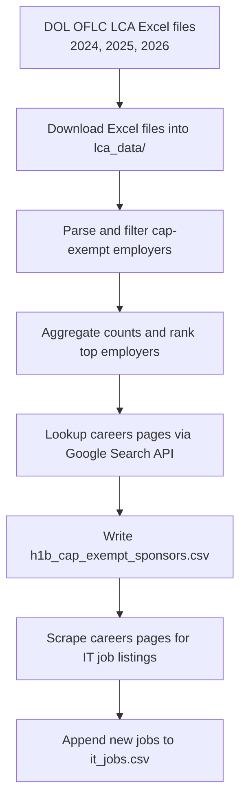

# H1B Nonprofit Employer Scraper

A Python pipeline for identifying cap-exempt H1B employers from U.S. DOL LCA data, locating their careers pages, and scraping IT job listings from those pages.

## What this project does

- Downloads DOL OFLC LCA disclosure Excel files for 2024, 2025, and 2026.
- Parses the files to identify cap-exempt employers based on NAICS codes and employer name keywords.
- Aggregates H1B counts by year and ranks the top employers.
- Uses the Serper.dev Google Search API to find company careers pages.
- Writes the employer list to `h1b_cap_exempt_sponsors.csv`.
- Optionally scrapes IT job listings from those careers pages into `it_jobs.csv`.

## Pipeline flow



## Output files

- `h1b_cap_exempt_sponsors.csv`
  - company
  - careers_page
  - state
  - h1b_2026
  - h1b_2025
  - h1b_2024

- `it_jobs.csv`
  - company
  - job_title
  - job_url
  - location
  - date_posted
  - scraped_at_pst

- `h1b_cap_exempt_checkpoint.json`
  - resume state used during careers page lookup and enrichment

## Core scripts

### `scrapper.py`

The main active entry point for this repo.

- Downloads DOL OFLC LCA Excel files into `lca_data/`.
- Parses each year for cap-exempt employers.
- Aggregates employer counts and ranks the top sponsors.
- Looks up careers page URLs using `careers_finder.py`.
- Writes the final output to `h1b_cap_exempt_sponsors.csv`.

### `dol_parser.py`

- Downloads DOL LCA disclosure Excel files.
- Parses the spreadsheets for employer records.
- Applies cap-exempt NAICS and keyword filters.
- Produces normalized employer report data for each year.

### `careers_finder.py`

- Experimental lookup helper for company careers pages.
- Uses the Serper.dev Google Search API to search for `company careers` and `company jobs`.
- Filters out aggregator domains like LinkedIn, Indeed, Glassdoor, ZipRecruiter, and Wikipedia.
- Returns a careers page URL for `scrapper.py` to save.

### Future / experimental pipeline components

The following files are present as planning or next-phase support, but are not required for the core sponsor list generation:

- `cron_jobs.py` — a scheduler wrapper intended to run the pipeline end-to-end.
- `IT_job.py` — a future job scraper that reads `h1b_cap_exempt_sponsors.csv` and scrapes IT listings from careers pages.

### `config.py`

Defines shared settings, file paths, and filter rules, including:

- `DOL_FILES` URLs
- cap-exempt NAICS and keyword filters
- careers search keyword rules
- blocked aggregator domains
- polite sleep timing

## Requirements

This repo includes a `requirements.txt` file.

Install dependencies with:

```bash
source venv/bin/activate
python3 -m pip install -r requirements.txt
python3 -m playwright install chromium
```

## Setup

1. Activate the virtual environment:

```bash
source venv/bin/activate
```

2. Set your Serper API key:

```bash
export SERPER_API_KEY=your_key_here
```

3. Run the pipeline:

```bash
python3 scrapper.py
```

## Run the full job pipeline

To execute both company lookup and job scraping:

```bash
python3 cron_jobs.py
```

## Notes

- `scrapper.py` depends on a working `SERPER_API_KEY` for Google search.
- Some companies may not return a clean careers page URL.
- IT job scraping is heuristic-based and may miss postings on non-standard pages.
- Job scraping is intended for U.S. locations and filters by U.S. job location patterns.

## Recommended workflow

1. Run `python3 scrapper.py` to generate the sponsor list.
2. Run `python3 cron_jobs.py` to refresh the list and scrape new job postings.
3. Analyze `h1b_cap_exempt_sponsors.csv` and `it_jobs.csv`.

## License

Add a license if you plan to distribute or publish this project.
