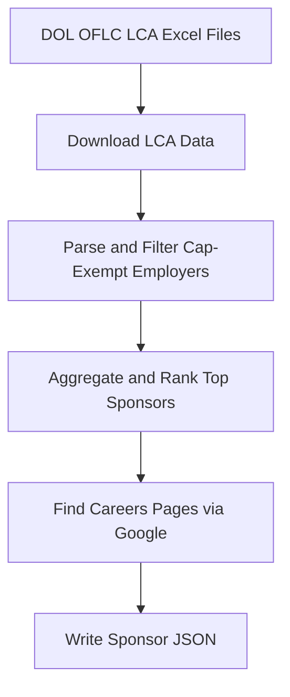

# H1B Cap-Exempt Employer Scraper

A Python pipeline that identifies cap-exempt H1B employers from U.S. Department of Labor LCA disclosure data, ranks them by sponsorship volume, and surfaces their careers pages for job seekers.

## Overview

H1B cap-exempt employers — primarily universities, nonprofit research institutions, and affiliated organizations — are not subject to the annual H1B lottery. This tool automates the process of identifying those employers from public DOL data, ranking them by H1B petition activity, and finding their careers pages.

## What it does

1. Downloads DOL OFLC LCA disclosure Excel files for fiscal years 2024-2026
2. Parses and filters employers based on cap-exempt NAICS codes and name keywords
3. Aggregates H1B petition counts by year and ranks the top sponsors
4. Looks up each employer's careers page via Google Search (Serper.dev API)
5. Writes the final employer list to `h1b-cap-exempt-sponsors.json`

## Pipeline



## Output

### `h1b-cap-exempt-sponsors.json`

A JSON array of employer objects, each with these fields (petition counts are
numbers or `null` when unknown):

| Field | Description |
|---|---|
| `company` | Employer name |
| `careers_page` | Careers page URL |
| `state` | Employer state |
| `h1b_2024` | H1B petition count, FY2024 |
| `h1b_2025` | H1B petition count, FY2025 |
| `h1b_2026` | H1B petition count, FY2026 |

### `h1b-cap-exempt-checkpoint.json`

Internal resume state used to continue an interrupted run without restarting from scratch.

## Scripts

### Active

#### `sponsors.py`

Main entry point. Orchestrates the full pipeline: downloads LCA files, parses cap-exempt employers, aggregates counts, looks up careers pages, and writes the sponsor JSON.

#### `dol_parser.py`

Downloads DOL LCA Excel files and parses employer records. Applies cap-exempt NAICS code and keyword filters, and returns normalized per-year employer data.

#### `careers_finder.py`

Finds careers page URLs for each employer using the Serper.dev Google Search API. Filters out job aggregators (LinkedIn, Indeed, Glassdoor, etc.) and falls back to the employer's official site if no careers page is found.

#### `config.py`

Shared constants and configuration, including DOL file URLs, cap-exempt filter rules, and careers search settings.

### Planned

The following scripts exist in the codebase but are not yet integrated into the active pipeline. They are scoped for future phases.

#### Phase 2 — Job Scraping

- **`jobs.py`** — Scrapes devops/devsecops/aws job listings from employer careers pages and appends results to `it-jobs.jsonl` (one JSON object per line).
- **`ats.py`** — Detects the ATS behind a careers page (Workday, Phenom/Radancy, iCIMS) and keyword-searches its API/results over plain HTTP, pulling structured location/country from each provider.
- **`ats_scrapers.py`** — Generic landing-page fallback scraper, used by `jobs.py` when no ATS adapter matches.
- **`cron_jobs.py`** — Scheduler that chains the full pipeline end-to-end and runs it automatically on a recurring schedule.

#### Phase 3 — UI

A web interface for job seekers to search, filter, and browse H1B cap-exempt employers and their open IT positions.

## Setup

### Prerequisites

- Python 3.11+
- A [Serper.dev](https://serper.dev) API key — free tier includes 2,500 searches/month, no credit card required

### Installation

```bash
python3 -m venv venv
source venv/bin/activate
pip install -r requirements.txt
```

> **Note:** Run `python3 -m playwright install chromium` when you are ready to use the job scraping phase.

### Configuration

```bash
export SERPER_API_KEY=your_key_here
```

### Run

```bash
python3 sponsors.py
```

## Caveats

- DOL LCA data reflects petition filings, not hiring outcomes. A high count indicates sponsorship activity, not guaranteed openings.
- Employer name normalization is heuristic-based; some duplicates or variants may appear.
- Job scraping and the UI are planned for future releases.

## License

This project does not currently include a license. Add one before distributing or publishing.
