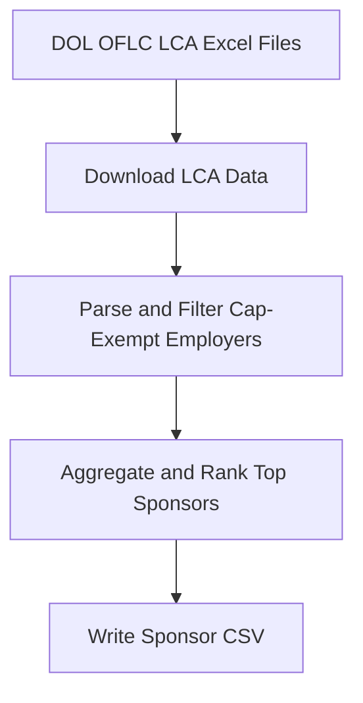

# H1B Cap-Exempt Employer Scraper

A Python pipeline that identifies cap-exempt H1B employers from U.S. Department of Labor LCA disclosure data and ranks them by sponsorship volume.

## Overview

H1B cap-exempt employers — primarily universities, nonprofit research institutions, and affiliated organizations — are not subject to the annual H1B lottery. This tool automates the process of identifying those employers from public DOL data and ranking them by H1B petition activity.

## What it does

1. Downloads DOL OFLC LCA disclosure Excel files for fiscal years 2024-2026
2. Parses and filters employers based on cap-exempt NAICS codes and name keywords
3. Aggregates H1B petition counts by year and ranks the top sponsors
4. Writes the final employer list to `h1b_cap_exempt_sponsors.csv`

## Pipeline



## Output

### `h1b_cap_exempt_sponsors.csv`

| Column | Description |
|---|---|
| `company` | Employer name |
| `state` | Employer state |
| `h1b_2024` | H1B petition count, FY2024 |
| `h1b_2025` | H1B petition count, FY2025 |
| `h1b_2026` | H1B petition count, FY2026 |

### `h1b_cap_exempt_checkpoint.json`

Internal resume state used to continue an interrupted run without restarting from scratch.

## Scripts

### Active

#### `scraper.py`

Main entry point. Orchestrates the full pipeline: downloads LCA files, parses cap-exempt employers, aggregates counts, and writes the sponsor CSV.

#### `dol_parser.py`

Downloads DOL LCA Excel files and parses employer records. Applies cap-exempt NAICS code and keyword filters, and returns normalized per-year employer data.

#### `config.py`

Shared constants and configuration, including DOL file URLs and cap-exempt filter rules.

### Planned

The following are planned for future phases and are not yet implemented in the codebase.

#### `careers_finder.py`

Will use the Serper.dev Google Search API to locate careers page URLs for each employer in the sponsor list, filtering out job aggregators (LinkedIn, Indeed, Glassdoor, etc.).

#### `IT_job.py`

Will scrape IT job listings directly from employer careers pages and write results to `it_jobs.csv`.

#### `ats_scrapers.py`

Will provide ATS-specific scrapers (Greenhouse, Lever, Workday, iCIMS, etc.) and a generic fallback, used by `IT_job.py` to extract job listings from a wide range of careers page formats.

#### `cron_jobs.py`

Will orchestrate the end-to-end pipeline on a schedule, chaining `scraper.py` and `IT_job.py` sequentially.

## Setup

### Prerequisites

- Python 3.11+

### Installation

```bash
python3 -m venv venv
source venv/bin/activate
pip install -r requirements.txt
python3 -m playwright install chromium
```

### Run

```bash
python3 scraper.py
```

## Caveats

- DOL LCA data reflects petition filings, not hiring outcomes. A high count indicates sponsorship activity, not guaranteed openings.
- Employer name normalization is heuristic-based; some duplicates or variants may appear.
- Careers page lookup and job scraping are planned for a future release.

## License

This project does not currently include a license. Add one before distributing or publishing.
